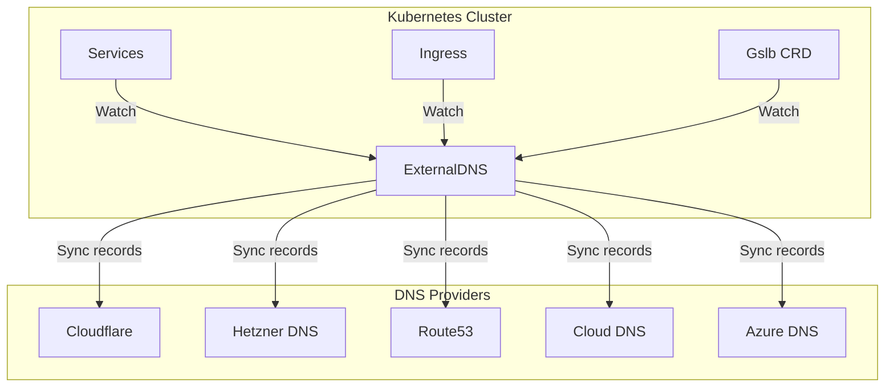
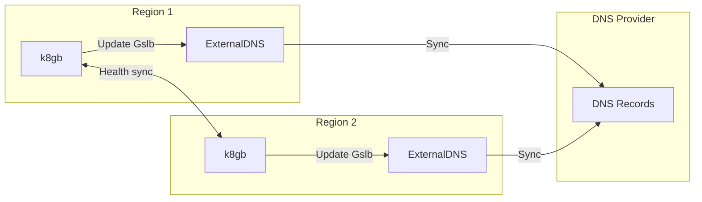

# ADR: ExternalDNS for DNS Record Management

**Status:** Accepted
**Date:** 2024-10-01
**Updated:** 2026-01-16

## Context

Need automated DNS record management that:
- Syncs Kubernetes resources to external DNS providers
- Works with multiple DNS providers (Cloudflare, Hetzner, Route53, etc.)
- Integrates with k8gb for GSLB functionality
- Supports multi-region deployments

## Decision

Use **ExternalDNS** for automated DNS record synchronization from Kubernetes to external DNS providers.

## Architecture



## Integration with k8gb

ExternalDNS and k8gb work together for multi-region DNS:



**Responsibilities:**
- **k8gb**: Health checking, GSLB logic, determines which IPs are healthy
- **ExternalDNS**: Syncs the resulting DNS records to the provider

## Supported DNS Providers

| Provider | Availability | ExternalDNS Support |
|----------|--------------|---------------------|
| Cloudflare | Always | Built-in |
| Hetzner DNS | If Hetzner chosen | Built-in |
| AWS Route53 | If AWS chosen | Built-in |
| GCP Cloud DNS | If GCP chosen | Built-in |
| Azure DNS | If Azure chosen | Built-in |

## Configuration

### Deployment

```yaml
apiVersion: apps/v1
kind: Deployment
metadata:
  name: external-dns
  namespace: external-dns
spec:
  replicas: 1
  selector:
    matchLabels:
      app: external-dns
  template:
    metadata:
      labels:
        app: external-dns
    spec:
      serviceAccountName: external-dns
      containers:
        - name: external-dns
          image: registry.k8s.io/external-dns/external-dns:v0.14.0
          args:
            - --source=service
            - --source=ingress
            - --source=crd
            - --crd-source-apiversion=k8gb.absa.oss/v1beta1
            - --crd-source-kind=Gslb
            - --provider=cloudflare  # or hetzner, aws, google, azure
            - --policy=sync
            - --registry=txt
            - --txt-owner-id=<tenant>-<region>
            - --txt-prefix=externaldns-
          env:
            - name: CF_API_TOKEN
              valueFrom:
                secretKeyRef:
                  name: cloudflare-credentials
                  key: api-token
```

### Provider-Specific Configuration

#### Cloudflare

```yaml
args:
  - --provider=cloudflare
  - --cloudflare-proxied  # optional: enable Cloudflare proxy
env:
  - name: CF_API_TOKEN
    valueFrom:
      secretKeyRef:
        name: cloudflare-credentials
        key: api-token
```

#### Hetzner DNS

```yaml
args:
  - --provider=hetzner
env:
  - name: HETZNER_TOKEN
    valueFrom:
      secretKeyRef:
        name: hetzner-credentials
        key: api-token
```

#### AWS Route53

```yaml
args:
  - --provider=aws
  - --aws-zone-type=public
env:
  - name: AWS_ACCESS_KEY_ID
    valueFrom:
      secretKeyRef:
        name: aws-credentials
        key: access-key-id
  - name: AWS_SECRET_ACCESS_KEY
    valueFrom:
      secretKeyRef:
        name: aws-credentials
        key: secret-access-key
```

## TXT Record Ownership

ExternalDNS uses TXT records to track ownership:

```
app.example.com.           A     1.2.3.4
externaldns-app.example.com. TXT   "heritage=external-dns,external-dns/owner=tenant-region1"
```

This prevents:
- Multiple ExternalDNS instances conflicting
- Accidental deletion of manually created records

## Sync Policies

| Policy | Behavior |
|--------|----------|
| `sync` | Create, update, and delete records |
| `upsert-only` | Create and update, never delete |
| `create-only` | Only create new records |

**Recommended:** `sync` for full automation

## Consequences

**Positive:**
- Automated DNS management
- Multi-provider support
- Native k8gb integration
- GitOps-friendly (declarative)

**Negative:**
- Requires DNS provider API credentials
- TXT record overhead
- Provider-specific quirks

## Related

- [ADR-K8GB-GSLB](../../k8gb/docs/ADR-K8GB-GSLB.md)
- [SPEC-DNS-FAILOVER](../../handbook/docs/specs/SPEC-DNS-FAILOVER.md)
